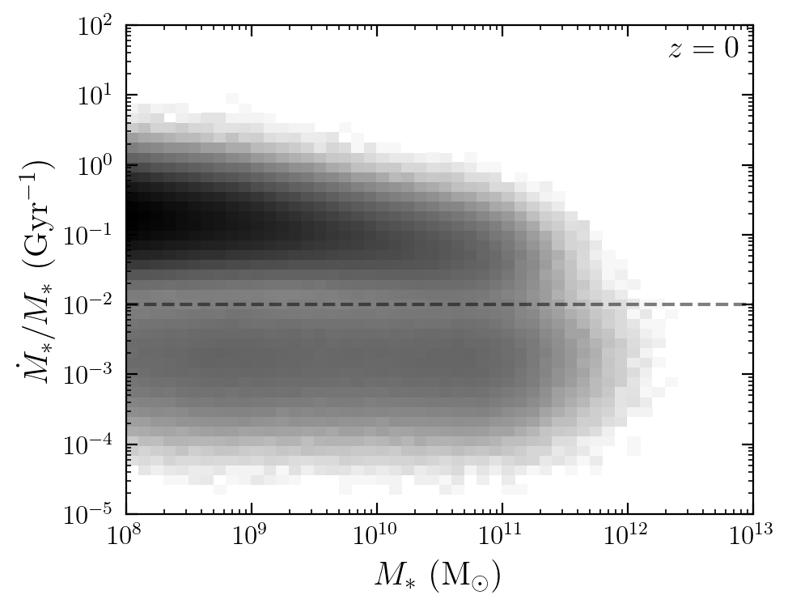
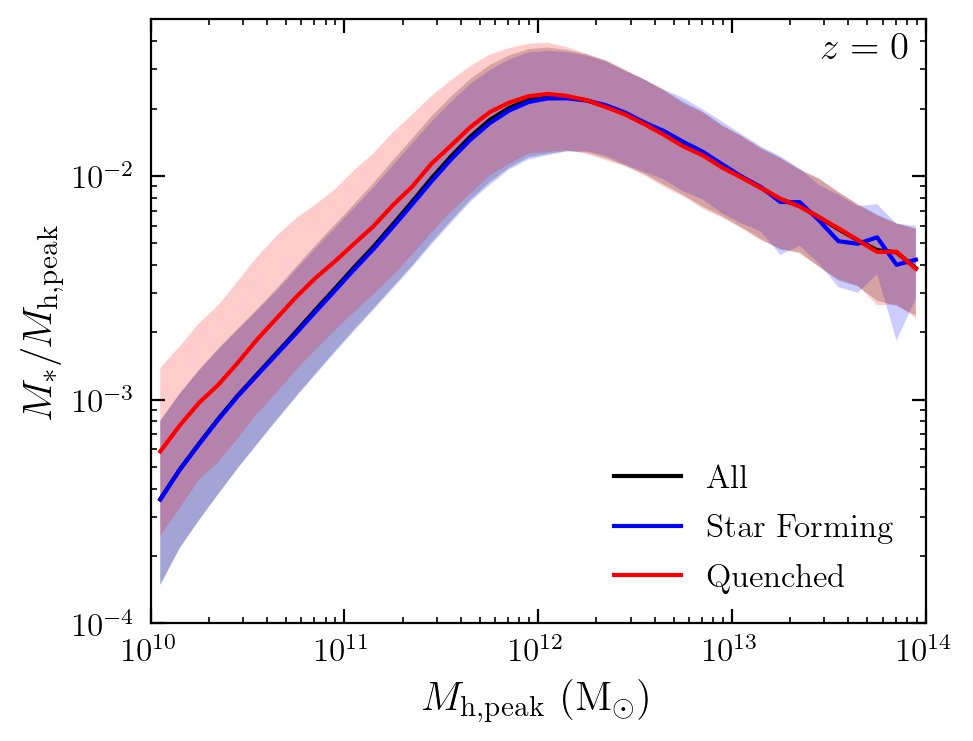
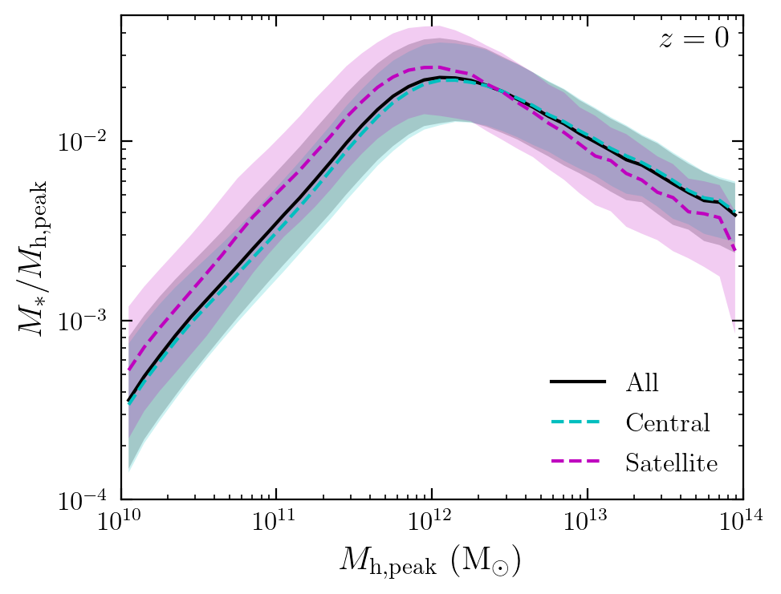
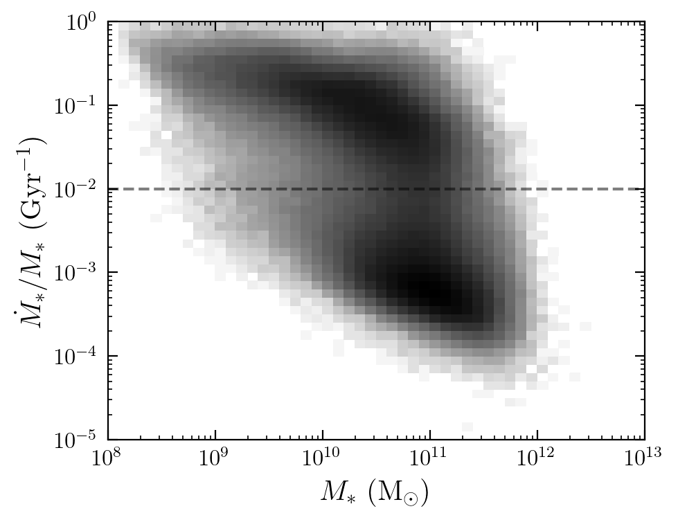

## Astronomy 534 "Extragalactic Universe" (Winter 2021)

## Project 2: Bimodal distribution of specific star formation rate in UniverseMachine

By Bill Chen

## Before running the notebook

The notebook requires the FSPS v3.0 package ([Conroy, Gunn & White 2009](https://ui.adsabs.harvard.edu/abs/2009ApJ...699..486C/abstract); [Conroy & Gunn 2010](https://ui.adsabs.harvard.edu/abs/2010ApJ...712..833C/abstract)). The star formation rate catalog is stored in 
```
./sfr_catalog_1.002310.bin
```
stellar mass-bined star formation hostories in
```
./umachine-dr1/data/sfhs/sfh_sm10.30_a1.002310.dat
```
and the observational data from NYU VAGC ([Blanton et al. 2005](https://ui.adsabs.harvard.edu/abs/2005AJ....129.2562B/abstract), http://sdss.physics.nyu.edu/vagc/) in 
```
./lowz_catalog.dr4.fits
```
A matplotlib style sheet is also required as 
```
../mplstyle.txt
```
It may take several minutes to run the entire notebook with a normal laptop.

## Introduction

The UniverseMachine ([Behroozi et al. 2019](https://ui.adsabs.harvard.edu/abs/2019MNRAS.488.3143B/abstract)) is a framework to model star formation in dark matter halos. It applies theoretical models to calculate the star formation rate (SFR) of each dark matter halo at a given time, and the SFR model is strongly linked to the merger history of halos. The final stellar mass is calculated as the integral of SFR, subtracting mass loss by stellar evolution. In order to compare the final results with observations, the final results are further corrected for observational effects. An MCMC method is also applied to calibrate the model to best fit the observations.

The only input for the UniverseMachine is the merger trees from dark matter-only simulations and several adjustable parameters. The above features make the UniverseMachine a simple but powerful tool to analyze the stellar components of galaxies. For example, the UniverseMachine can predict the stellar mass-halo mass relation overcoming the disadvantages of the abundance matching method. Additionally, the UniverseMachine is a flexible database that can be post-processed to investigate other interesting features. In this work, we (I mean "I") first analyze the bimodal distribution of specific SFR (SSFR) by investigating different properties of high- and low-SSFR galaxies. Next, we apply a stellar population synthesis (SPS) analysis to calculate the colors for different subsets of galaxies. We conclude that the colors of star-forming and quenched galaxies are very different, while those of central and satellite galaxies are generally similar.


```python
import os
os.environ['SPS_HOME'] = "/Users/ybchen/Documents/20_21_wn/Astro_534_Cosmology/project2/fsps"
import numpy as np
import matplotlib as mpl
import matplotlib.pyplot as plt
import fsps
import astro_utils
plt.style.use('../mplstyle.txt')
```


```python
BOX_SIZE = 250 #In Mpc/h
Om = 0.307     #Omega_matter
Ol = 0.693     #Omega_lambda
h0 = 0.68      #h0 = H0 / (100 km/s/Mpc)
fb = 0.158     #cosmic baryon fraction
```


```python
dtype = np.dtype(dtype=[('id', 'i8'),('descid','i8'),('upid','i8'),
    ('flags', 'i4'), ('uparent_dist', 'f4'),
    ('pos', 'f4', (6)), ('vmp', 'f4'), ('lvmp', 'f4'),
    ('mp', 'f4'), ('m', 'f4'), ('v', 'f4'), ('r', 'f4'),
    ('rank1', 'f4'), ('rank2', 'f4'), ('ra', 'f4'),
    ('rarank', 'f4'), ('A_UV', 'f4'), ('sm', 'f4'), 
    ('icl', 'f4'), ('sfr', 'i4'), ('obs_sm', 'f4'), 
    ('obs_sfr', 'f4'), ('obs_uv', 'f4'), ('empty', 'f4')],
    align=True)
```

### Field explanations:
**Note that halo masses are in Msun/h and stellar masses/SFRs are in Msun.**  
**ID**: Unique halo ID (**varies at different snapshots**)   
**DescID**: ID of descendant halo (or -1 at z=0).  
**UPID**: -1 for central halos, otherwise, ID of largest parent halo  
**Flags**: Mostly internal UniverseMachine info.  However, halos with bit 4 set in the flags (i.e., flags & (2^4) is true) should be ignored.  
**Uparent_Dist**: Ignore  
**pos**: (X,Y,Z,VX,VY,VZ)  
   **X Y Z**: halo position (comoving Mpc/h)  
   **VX VY VZ**: halo velocity (physical peculiar km/s)  
**M**: Halo mass (Bryan & Norman 1998 virial mass, Msun/h)  
**V**: Halo vmax (physical km/s)  
**MP**: Halo peak historical mass (BN98 vir, Msun/h)  
**VMP**: Halo vmax at the time when peak mass was reached.  
**R**: Halo radius (BN98 vir, comoving kpc/h)  
**Rank1**: halo rank in Delta_vmax (see UniverseMachine paper)  
**Rank2**, RA, RARank: Ignore  
**A_UV**: UV attenuation (mag)  
**SM**: True stellar mass (Msun)  
**ICL**: True intracluster stellar mass (Msun)  
**SFR**: True star formation rate (Msun/yr)  
**Obs_SM**: observed stellar mass, including random & systematic errors (Msun)  
**Obs_SFR**: observed SFR, including random & systematic errors (Msun/yr)  
**Obs_UV**: Observed UV Magnitude (M_1500 AB)  

## Bimodal distribution of specific star formation rate

By plotting the distribution of all UniverseMachine galaxies at $z=0$ in the stellar mass-SSFR space, we see clear bimodality in SSFR with a threshold of $\sim0.01\ {\rm Gyr^{-1}}$, see below. Surprisingly, this bimodality is irrelated to the stellar masses of galaxies. Motivated by this,  we divide the total set of galaxies into star-forming ($\dot{M}_*/M_*>0.01\ {\rm Gyr^{-1}}$) and quenched ($\dot{M}_*/M_*<0.01\ {\rm Gyr^{-1}}$) galaxies in the following discussion.

Since the only input of the UniverseMachine is the halo merger tree, this bimodality suggests two distinct modes for galaxy assembly, and the two modes are insensitive to the masses of galaxies. To better understand the two modes for galaxy assembly, we should quantitatively investigate the merger trees of the two modes. However, the catalog of the UniverseMachine is stored in Google Drive, which limits the number of attempts to download the data (by adding the IP to the blocklist). Also, the merger trees provided by the UniverseMachine do not keep the IDs of halos invariant. Therefore, we must download the entire catalog for merger trees (if the IDs are invariant, we can download a subset of snapshots still knowing the descendant relation) So, we have decided not to investigate the detailed relation of the aforementioned bimodality to merger histories.


```python
# load galaxy catalog at z=0
data = np.fromfile('sfr_catalog_1.002310.bin', dtype=dtype)
data = data[data['flags']!=16]
data = data[data['sm'] > 0]
```


```python
fig, ax0 = plt.subplots(figsize=(5,4), sharex=True, sharey=True)

bins = [np.logspace(8,13,50+1), np.logspace(-5,2,50+1)]
ax0.hist2d(data['obs_sm']/h0, data['obs_sfr']/data['obs_sm']*1e9, bins=bins, 
    norm=mpl.colors.LogNorm(), cmap='Greys')

ax0.hlines(1e-2, 1e8, 1e13, color='k', alpha=0.5, ls='--')
# ax0.text(0.55, 0.4, r'$\rm SSFR=10^{-2}\ {Gyr^{-1}}$', transform=ax0.transAxes,
#     horizontalalignment='left', verticalalignment='top', fontsize=14, alpha=0.5)

ax0.text(0.98, 0.98, r'$z=0$', transform=ax0.transAxes,
    horizontalalignment='right', verticalalignment='top', fontsize=14)

ax0.set_xscale('log')
ax0.set_yscale('log')
ax0.set_xlabel(r'$M_*\ ({\rm M_\odot})$')
ax0.set_ylabel(r'$\dot{M}_*/M_*\ ({\rm Gyr^{-1}})$')

plt.show()
```





## Star formation efficiency

We plot the peak halo mass ($M_{\rm h,peak}$)-star formation efficiency (SFE, $M_*/M_{\rm h,peak}$) relation as below. The SFE of star-forming galaxies are slightly larger than the quenched ones in the low-mass end, but the deviation is still less than the one-$\sigma$ range. This indicates that the two modes of galaxy assembly result in similar SFE, though the present-day SFR can be dramatically different. 

We also plot the SFE of central and satellite galaxies, as they are clearly distinguished in simulations. The general behaviors of SFE for the two kinds of galaxies are also similar, except that the central galaxies have (slightly) higher SFE at the high-mass end and lower SFE at the low-mass end. 


```python
# SFE-halo mass relation
x = np.logspace(10, 14, 40+1)
y_16 = []
y_50 = []
y_84 = []
y_sf_16 = []
y_sf_50 = []
y_sf_84 = []
y_q_16 = []
y_q_50 = []
y_q_84 = []

for i in range(len(x)-1):
    idx = np.where((data['mp']/h0>x[i]) & (data['mp']/h0<x[i+1]))[0]
    y_16.append(np.percentile(data['sm'][idx]*h0/data['mp'][idx], 16))
    y_50.append(np.percentile(data['sm'][idx]*h0/data['mp'][idx], 50))
    y_84.append(np.percentile(data['sm'][idx]*h0/data['mp'][idx], 84))
    
    idx_sf = np.where((data['mp']/h0>x[i]) & (data['mp']/h0<x[i+1]) & 
        (data['obs_sfr']/data['obs_sm']*1e9>0.01))[0]
    y_sf_16.append(np.percentile(data['sm'][idx_sf]*h0/data['mp'][idx_sf], 16))
    y_sf_50.append(np.percentile(data['sm'][idx_sf]*h0/data['mp'][idx_sf], 50))
    y_sf_84.append(np.percentile(data['sm'][idx_sf]*h0/data['mp'][idx_sf], 84))
    
    idx_q = np.where((data['mp']/h0>x[i]) & (data['mp']/h0<x[i+1]) & 
        (data['obs_sfr']/data['obs_sm']*1e9<0.01))[0]
    y_q_16.append(np.percentile(data['sm'][idx_q]*h0/data['mp'][idx_q], 16))
    y_q_50.append(np.percentile(data['sm'][idx_q]*h0/data['mp'][idx_q], 50))
    y_q_84.append(np.percentile(data['sm'][idx_q]*h0/data['mp'][idx_q], 84))
```


```python
fig, ax0 = plt.subplots(figsize=(5,4), sharex=True, sharey=True)

x = np.logspace(10, 14, 40+1)
x = np.sqrt(x[:-1]*x[1:])
ax0.plot(x,y_50, c='k', label=r'$\rm All$')
ax0.fill_between(x, y_16, y_84, facecolor='k', edgecolor=None, alpha=0.2)
ax0.plot(x,y_sf_50, c='b', label=r'$\rm Star\ Forming$')
ax0.fill_between(x, y_sf_16, y_sf_84, facecolor='b', edgecolor=None, alpha=0.2)
ax0.plot(x,y_q_50, c='r', label=r'$\rm Quenched$')
ax0.fill_between(x, y_q_16, y_q_84, facecolor='r', edgecolor=None, alpha=0.2)

ax0.text(0.98, 0.98, r'$z=0$', transform=ax0.transAxes,
    horizontalalignment='right', verticalalignment='top', fontsize=14)

ax0.set_xscale('log')
ax0.set_yscale('log')
ax0.set_xlabel(r'$M_{\rm h,peak}\ ({\rm M_\odot})$')
ax0.set_ylabel(r'$M_*/M_{\rm h,peak}$')
ax0.set_xlim(1e10, 1e14)
ax0.set_ylim(1e-4, 5e-2)
ax0.legend()

plt.show()
```





```python
# SFE-halo mass relation
x = np.logspace(10, 14, 40+1)
y_c_16 = []
y_c_50 = []
y_c_84 = []
y_s_16 = []
y_s_50 = []
y_s_84 = []

for i in range(len(x)-1):
    idx_c = np.where((data['mp']/h0>x[i]) & (data['mp']/h0<x[i+1]) & 
        (data['upid']<0))[0]
    y_c_16.append(np.percentile(data['sm'][idx_c]*h0/data['mp'][idx_c], 16))
    y_c_50.append(np.percentile(data['sm'][idx_c]*h0/data['mp'][idx_c], 50))
    y_c_84.append(np.percentile(data['sm'][idx_c]*h0/data['mp'][idx_c], 84))
    
    idx_s = np.where((data['mp']/h0>x[i]) & (data['mp']/h0<x[i+1]) & 
        (data['upid']>0))[0]
    y_s_16.append(np.percentile(data['sm'][idx_s]*h0/data['mp'][idx_s], 16))
    y_s_50.append(np.percentile(data['sm'][idx_s]*h0/data['mp'][idx_s], 50))
    y_s_84.append(np.percentile(data['sm'][idx_s]*h0/data['mp'][idx_s], 84))
```


```python
fig, ax0 = plt.subplots(figsize=(5,4), sharex=True, sharey=True)

x = np.logspace(10, 14, 40+1)
x = np.sqrt(x[:-1]*x[1:])
ax0.plot(x,y_50, c='k', label=r'$\rm All$')
ax0.fill_between(x, y_16, y_84, facecolor='k', edgecolor=None, alpha=0.2)
ax0.plot(x,y_c_50, c='c', ls='--', label=r'$\rm Central$')
ax0.fill_between(x, y_c_16, y_c_84, facecolor='c',edgecolor=None, alpha=0.2)
ax0.plot(x,y_s_50, c='m', ls='--', label=r'$\rm Satellite$')
ax0.fill_between(x, y_s_16, y_s_84, facecolor='m', edgecolor=None, alpha=0.2)

ax0.text(0.98, 0.98, r'$z=0$', transform=ax0.transAxes,
    horizontalalignment='right', verticalalignment='top', fontsize=14)

ax0.set_xscale('log')
ax0.set_yscale('log')
ax0.set_xlabel(r'$M_{\rm h,peak}\ ({\rm M_\odot})$')
ax0.set_ylabel(r'$M_*/M_{\rm h,peak}$')
ax0.set_xlim(1e10, 1e14)
ax0.set_ylim(1e-4, 5e-2)
ax0.legend()

plt.show()
```





## Stellar population synthesis

The UniverseMachine is a powerful database, which can be post-processed for other interesting analyses. For example, we can calculate the multiband magnitudes of galaxies using stellar population synthesis (SPS). To start with, I briefly introduce the basic idea of SPS as follows.

The light of a galaxy can be viewed as the combination of light from simple stellar populations (SSPs) formed at different times. By setting the initial mass function (IMF) of each SSP to be $\Phi(M)$, we get the spectrum of this SSP,

$$
S_\nu(t) = \int \Phi(M)\Lambda_\nu(M,Z,t)\ dM,
$$

where $Z=Z(t)$ is the metallicity, $t$ is the time after birth, and $\Lambda_\nu(M,Z,t)$ stands for the luminosity of a star with mass $M$. In this work, we apply the MIST isochrones and MILES spectral library to calculate $\Lambda_\nu(M,Z,t)$. Therefore, the net spectrum is the convolution of $S_\nu(t)$ and the SFR, $\Psi(t)$,

$$
F_\nu(t) = (\Psi*S_\nu)(t) = \int_0^t \Psi(t-t')S_\nu(t')\ dt'.
$$

For simplicity, we assume $Z=Z_\odot$ and use a [Chabrier (2003)](https://ui.adsabs.harvard.edu/abs/2003PASP..115..763C/abstract) IMF, for consistency with UniverseMachine. We also neglect the attenuation of starlight by dust; since we are interested in relative magnitude between bands, e.g., SDSS $\rm g-z$, which is less sensitive to attenuation. The above steps can be easily applied to the UniverseMachine catalog by employing the FSPS package ([Conroy, Gunn & White 2009](https://ui.adsabs.harvard.edu/abs/2009ApJ...699..486C/abstract); [Conroy & Gunn 2010](https://ui.adsabs.harvard.edu/abs/2010ApJ...712..833C/abstract)).

We apply SPS on all galaxies of UniverseMachine, as well as subsets of star-forming, quenched, central, and satellite galaxies, to get the SDSS $\rm g-z$ magnitude, which can be viewed as the colors of galaxies. A Monte-Carlo method is applied to estimate the scatters of colors. First, we generate a new random realization of star formation history by re-sampling the SFR at each time with a Gaussian distribution. The mean value and standard deviation of the Gaussian distribution is given by the UniverseMachine catalog. Next, we calculate the color of this new realization via SPS. We repeat the two steps until we have enough random realizations for statistic analysis. Finally, we compute the 16-, 50-, and 84-percentiles of colors for each subset of galaxies.

A comparison with observational results from NYU VAGC ([Blanton et al. 2005](https://ui.adsabs.harvard.edu/abs/2005AJ....129.2562B/abstract), http://sdss.physics.nyu.edu/vagc/) is also given in this work. The stellar mass is calculated with the stellar mass-to-light ratio provided by ([Bell et al. 2003](https://ui.adsabs.harvard.edu/abs/2003ApJS..149..289B/abstract)),

$$
\log\left(\frac{M_*/{\rm M_\odot}}{L_{\rm g}/{\rm L_{g,\odot}}}\right) = -0.367 + 0.698M_{\rm g},
$$

where $L_{\rm g}$ and $M_{\rm g}$ are the SDSS $\rm g$ band luminosity and magnitude, respectively. As shown below, all subsets of galaxies have a monotonic increasing $\rm g-z$ with stellar mass, indicating that more massive galaxies are always redder. This trend is further verified by the observational scaling relation from NYU VAGC. There is a strong deviation in color for the star-forming and quenched galaxies: quenched galaxies are redder than star-forming galaxies by $\Delta({\rm g-z})\simeq 0.15$ in a broad range of stellar mass from $10^8$ to $10^{12}\ {\rm M_\odot}$. This deviation is as expected since the massive stars formed in young stellar populations contribute largely to the total luminosity of a galaxy. For star-forming galaxies, there are abundant massive stars, which makes the galaxies bluer than quenched ones. Therefore, it is reasonable to expect that the color distribution of galaxies also has a bimodality, similar to the SSFR distribution.

The color-mass relation of central galaxies is nearly identical to that of all galaxies (within one-$\sigma$ range). Also, compared with star-forming and quenched galaxies, the difference in color is smaller between central and satellite galaxies. At the low-mass end ($M_*<10^{10}\ {\rm M_\odot}$), both galaxies show similar $\rm g-z$, and the satellite galaxies becomes redder than central galaxies by $\Delta({\rm g-z})\simeq 0.05$ at $M_*>10^{10}\ {\rm M_\odot}$. However, a direct comparison between centrals and satellites in the same mass bin tends to overestimate the $\rm g-z$ of satellites since satellites are always gravitationally bound to central galaxies that are more massive.


```python
# load SFH
sfh = np.loadtxt('umachine-dr1/data/sfhs/sfh_sm10.30_a1.002310.dat')

a = sfh[:,0]
t = astro_utils.cosmicTime(-1+1/a, units = 'Gyr')
sfr_all = sfh[:,1]
```


```python
# initiate stellar population
sp = fsps.StellarPopulation(compute_vega_mags=False, zcontinuous=1, imf_type=1,
    sfh=3, logzsol=0.0, dust_type=2, dust2=0.0)
```


```python
# calculate SDSS-g and SDSS-r: without scatter

sdss_bands = ['sdss_g', 'sdss_r']
gr_all = []
gr_sf = []
gr_q = []
gr_c = []
gr_s = []
for i in np.arange(8.1,12.1,0.2):
    # load SFH
    sfh = np.loadtxt('umachine-dr1/data/sfhs/sfh_sm%.2f_a1.002310.dat'%i)
    a = sfh[:,0]
    t = astro_utils.cosmicTime(-1+1/a, units = 'Gyr')
    sfr_all = sfh[:,1]
    sfr_sf = sfh[:,4]
    sfr_q = sfh[:,7]
    sfr_c = sfh[:,10]
    sfr_s = sfh[:,13]
    
    # SPS
    # all galaxies
    sp.set_tabular_sfh(t, sfr_all)
    [g, r] = sp.get_mags(tage=t[-1], bands=sdss_bands)
    gr_all.append(g-r)
    
    # SF galaxies
    sp.set_tabular_sfh(t, sfr_sf)
    [g, r] = sp.get_mags(tage=t[-1], bands=sdss_bands)
    gr_sf.append(g-r)
    
    # Quenched galaxies
    sp.set_tabular_sfh(t, sfr_q)
    [g, r] = sp.get_mags(tage=t[-1], bands=sdss_bands)
    gr_q.append(g-r)
    
    # central galaxies
    sp.set_tabular_sfh(t, sfr_c)
    [g, r] = sp.get_mags(tage=t[-1], bands=sdss_bands)
    gr_c.append(g-r)
    
    # satellite galaxies
    sp.set_tabular_sfh(t, sfr_s)
    [g, r] = sp.get_mags(tage=t[-1], bands=sdss_bands)
    gr_s.append(g-r)

gr_all = np.array(gr_all)
gr_sf = np.array(gr_sf)
gr_q = np.array(gr_q)
gr_c = np.array(gr_c)
gr_s = np.array(gr_s)
```


```python
# calculate SDSS-g and SDSS-r: with scatter

# use Monte-Carlo method to get scatter
def mc():
    sdss_bands = ['sdss_g', 'sdss_z']
    gr_all = []
    gr_sf = []
    gr_q = []
    gr_c = []
    gr_s = []
    for i in np.arange(8.1,12.1,0.2):
        # load SFH
        sfh = np.loadtxt('umachine-dr1/data/sfhs/sfh_sm%.2f_a1.002310.dat'%i)
        a = sfh[:,0]
        t = astro_utils.cosmicTime(-1+1/a, units = 'Gyr')
        sfr_all = np.clip(np.random.normal(loc=sfh[:,1], scale=(sfh[:,2] + sfh[:,3])/2), a_min=1e-33, a_max=None)
        sfr_sf = np.clip(np.random.normal(loc=sfh[:,4], scale=(sfh[:,5] + sfh[:,6])/2), a_min=1e-33, a_max=None)
        sfr_q = np.clip(np.random.normal(loc=sfh[:,7], scale=(sfh[:,8] + sfh[:,9])/2), a_min=1e-33, a_max=None)
        sfr_c = np.clip(np.random.normal(loc=sfh[:,10], scale=(sfh[:,11] + sfh[:,12])/2), a_min=1e-33, a_max=None)
        sfr_s = np.clip(np.random.normal(loc=sfh[:,13], scale=(sfh[:,14] + sfh[:,15])/2), a_min=1e-33, a_max=None)

        # SPS
        # all galaxies
        sp.set_tabular_sfh(t, sfr_all)
        [g, r] = sp.get_mags(tage=t[-1], bands=sdss_bands)
        gr_all.append(g-r)

        # SF galaxies
        sp.set_tabular_sfh(t, sfr_sf)
        [g, r] = sp.get_mags(tage=t[-1], bands=sdss_bands)
        gr_sf.append(g-r)

        # Quenched galaxies
        sp.set_tabular_sfh(t, sfr_q)
        [g, r] = sp.get_mags(tage=t[-1], bands=sdss_bands)
        gr_q.append(g-r)

        # central galaxies
        sp.set_tabular_sfh(t, sfr_c)
        [g, r] = sp.get_mags(tage=t[-1], bands=sdss_bands)
        gr_c.append(g-r)

        # satellite galaxies
        sp.set_tabular_sfh(t, sfr_s)
        [g, r] = sp.get_mags(tage=t[-1], bands=sdss_bands)
        gr_s.append(g-r)

    gr_all = np.array(gr_all)
    gr_sf = np.array(gr_sf)
    gr_q = np.array(gr_q)
    gr_c = np.array(gr_c)
    gr_s = np.array(gr_s)
    
    return gr_all, gr_sf, gr_q, gr_c, gr_s
```


```python
# calculate SDSS-g and SDSS-r: with scatter

grs_all = []
grs_sf = []
grs_q = []
grs_c = []
grs_s = []
for i in range(256):
    gr_all, gr_sf, gr_q, gr_c, gr_s = mc() # Monte-Carlo
    grs_all.append(gr_all)
    grs_sf.append(gr_sf)
    grs_q.append(gr_q)
    grs_c.append(gr_c)
    grs_s.append(gr_s)
    
grs_all = np.array(grs_all)
grs_sf = np.array(grs_sf)
grs_q = np.array(grs_q)
grs_c = np.array(grs_c)
grs_s = np.array(grs_s)

# 16-50-84 percentils
gr_all_16 = np.percentile(grs_all, 16, axis=0)
gr_all_50 = np.percentile(grs_all, 50, axis=0)
gr_all_84 = np.percentile(grs_all, 84, axis=0)
gr_sf_16 = np.percentile(grs_sf, 16, axis=0)
gr_sf_50 = np.percentile(grs_sf, 50, axis=0)
gr_sf_84 = np.percentile(grs_sf, 84, axis=0)
gr_q_16 = np.percentile(grs_q, 16, axis=0)
gr_q_50 = np.percentile(grs_q, 50, axis=0)
gr_q_84 = np.percentile(grs_q, 84, axis=0)
gr_c_16 = np.percentile(grs_c, 16, axis=0)
gr_c_50 = np.percentile(grs_c, 50, axis=0)
gr_c_84 = np.percentile(grs_c, 84, axis=0)
gr_s_16 = np.percentile(grs_s, 16, axis=0)
gr_s_50 = np.percentile(grs_s, 50, axis=0)
gr_s_84 = np.percentile(grs_s, 84, axis=0)
```


```python
# load NYU VAGC
from astropy.io import fits
obs = fits.open('lowz_catalog.dr4.fits')
```


```python
obs_data = obs[1].data
obs_g = obs_data['ABSMAG'][:,1]
obs_z = obs_data['ABSMAG'][:,4]
obs_gz = obs_g - obs_z
mass_to_light = -0.367 + (0.698*obs_gz) # Bell 2003
obs_m = 10**mass_to_light * 10**(-0.4*(obs_g - 5.11))
```


```python
# load SDSS DR8
obs = fits.open('SDSSspecgalsDR8.fit')
```


```python
obs_data = obs[1].data
obs_g = obs_data['modelMag_g']
obs_z = obs_data['modelMag_z']
obs_gz = obs_g - obs_z
obs_sfr = obs_data['sfr_tot_p50']
obs_m = 10**obs_data['lgm_tot_p50']
obs_ssfr = obs_sfr*1e9 / obs_m # in Gyr^-1
```

    <ipython-input-18-9b8d01fb8b91>:7: RuntimeWarning: divide by zero encountered in true_divide
      obs_ssfr = obs_sfr*1e9 / obs_m # in Gyr^-1


```python
fig, ax0 = plt.subplots(figsize=(5,4), sharex=True, sharey=True)

ax0.hist2d(obs_m, obs_ssfr, bins=[np.logspace(8,13,51), np.logspace(-5,0,51)],
    norm=mpl.colors.LogNorm(), cmap='Greys')

ax0.hlines(1e-2, 1e8, 1e13, color='k', alpha=0.5, ls='--')

ax0.set_xscale('log')
ax0.set_yscale('log')
ax0.set_xlabel(r'$M_*\ ({\rm M_\odot})$')
ax0.set_ylabel(r'$\dot{M}_*/M_*\ ({\rm Gyr^{-1}})$')

# plt.savefig('sdss_ssfr_m.png')
plt.show()
```





```python
x = 10**np.arange(9.0,11.41,0.2)
obs_gz_16 = []
obs_gz_50 = []
obs_gz_84 = []
obs_gz_sf_16 = []
obs_gz_sf_50 = []
obs_gz_sf_84 = []
obs_gz_q_16 = []
obs_gz_q_50 = []
obs_gz_q_84 = []
for i in range(len(x)-1):
    idx = np.where((obs_m>x[i]) & (obs_m<x[i+1]) & (obs_ssfr>0))[0]
    obs_gz_16.append(np.percentile(obs_gz[idx], 16))
    obs_gz_50.append(np.percentile(obs_gz[idx], 50))
    obs_gz_84.append(np.percentile(obs_gz[idx], 84))
    
    idx = np.where((obs_m>x[i]) & (obs_m<x[i+1]) & (obs_ssfr>1e-2))[0]
    obs_gz_sf_16.append(np.percentile(obs_gz[idx], 16))
    obs_gz_sf_50.append(np.percentile(obs_gz[idx], 50))
    obs_gz_sf_84.append(np.percentile(obs_gz[idx], 84))
    
    idx = np.where((obs_m>x[i]) & (obs_m<x[i+1]) & (obs_ssfr<1e-2) & (obs_ssfr>0))[0]
    obs_gz_q_16.append(np.percentile(obs_gz[idx], 16))
    obs_gz_q_50.append(np.percentile(obs_gz[idx], 50))
    obs_gz_q_84.append(np.percentile(obs_gz[idx], 84))

obs_x = 10**np.arange(9.1,11.31,0.2)
```


```python
fig, ax0 = plt.subplots(figsize=(5,5), sharex=True, sharey=True)

x = 10**np.arange(8.1,12.1,0.2)
ax0.plot(x, gr_all_50, c='k', label=r'$\rm All$')
ax0.fill_between(x, gr_all_16, gr_all_84, facecolor='k', edgecolor=None, alpha=0.2)
ax0.plot(x, gr_sf_50, c='b', label=r'$\rm Star\ Forming$')
ax0.fill_between(x, gr_sf_16, gr_sf_84, facecolor='b', edgecolor=None, alpha=0.2)
ax0.plot(x, gr_q_50, c='r', label=r'$\rm Quenched$')
ax0.fill_between(x, gr_q_16, gr_q_84, facecolor='r', edgecolor=None, alpha=0.2)
ax0.plot(x, gr_c_50, c='c', ls='--', label=r'$\rm Central$')
ax0.fill_between(x, gr_c_16, gr_c_84, facecolor='c', edgecolor=None, alpha=0.2)
ax0.plot(x[:-1], gr_s_50[:-1], c='m', ls='--', label=r'$\rm Satellite$')
ax0.fill_between(x[:-1], gr_s_16[:-1], gr_s_84[:-1], facecolor='m', edgecolor=None, alpha=0.2)

ax0.plot(obs_x, obs_gz_50, c='k', lw=3, ls='--', alpha=0.5, label=r'$\rm NYU\ VAGC$')
ax0.fill_between(obs_x, obs_gz_16, obs_gz_84, facecolor='k', edgecolor=None, alpha=0.1)
ax0.plot(obs_x, obs_gz_sf_50, c='b', lw=3, ls='--', alpha=0.5)
ax0.fill_between(obs_x, obs_gz_sf_16, obs_gz_sf_84, facecolor='b', edgecolor=None, alpha=0.1)
ax0.plot(obs_x, obs_gz_q_50, c='r', lw=3, ls='--', alpha=0.5)
ax0.fill_between(obs_x, obs_gz_q_16, obs_gz_q_84, facecolor='r', edgecolor=None, alpha=0.1)

ax0.text(0.98, 0.98, r'$z=0$', transform=ax0.transAxes,
    horizontalalignment='right', verticalalignment='top', fontsize=14)

ax0.set_xscale('log')
ax0.set_xlabel(r'$M_{*}\ ({\rm M_\odot})$')
ax0.set_ylabel(r'$\rm SDSS\ g-z$')
ax0.set_xlim(1e8, 1e12)
ax0.set_ylim(0.6, 1.6)
ax0.legend()

# plt.savefig('g_z_m.png')
plt.show()
```


## Summary

In this work, we first analyze the bimodal distribution of specific SFR (SSFR) by investigating different properties of high- and low-SSFR galaxies. Next, we apply a stellar population synthesis (SPS) analysis to calculate the colors for different subsets of galaxies. We find that the SSFR of galaxies shows a clear bimodal distribution, with a threshold of $\sim 0.01\ {\rm Gyr^{-1}}$. By dividing all galaxies into star-forming and quenched galaxies with this threshold, we show that the SFE of the two kinds of galaxies shows a similar trend as a function of halo mass. All of them have a peak SFE value of $\sim 0.02$ at $M_{\rm h,peak}\simeq 10^{12}\ {\rm M_\odot}$. Moreover, the SFE of central and satellite galaxies are also similar. It is reasonable to suggest that the SFE is a rather robust value only sensitive to the mass of the galaxy.

Applying an SPS analysis, we get the color-mass relation of all kinds of galaxies. All of them have a monotonic increasing $\rm g−z$ with stellar mass, indicating that more massive galaxies are always redder. This trend is also shown by the observational scaling relation from NYU VAGC. Despite the similarities, we find that the star-forming galaxies are largely bluer than the quenched galaxies by $\Delta({\rm g-z})\simeq 1.5$. Therefore, we can expect the color distribution of all galaxies to also has a bimodality.

## References

1. Behroozi et al., 2019. ADS: https://ui.adsabs.harvard.edu/abs/2019MNRAS.488.3143B/abstract
2. Bell et al., 2003. ADS: https://ui.adsabs.harvard.edu/abs/2003ApJS..149..289B/abstract
3. Blanton et al., 2005. ADS: https://ui.adsabs.harvard.edu/abs/2005AJ....129.2562B/abstract
4. Chabrier, 2003. ADS: https://ui.adsabs.harvard.edu/abs/2003PASP..115..763C/abstract
5. Conroy, Gunn, & White, 2009. ADS: https://ui.adsabs.harvard.edu/abs/2009ApJ...699..486C/abstract
6. Conroy & Gunn, 2010. ADS: https://ui.adsabs.harvard.edu/abs/2010ApJ...712..833C/abstract
